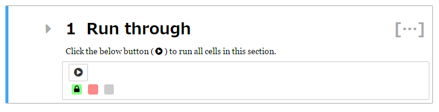
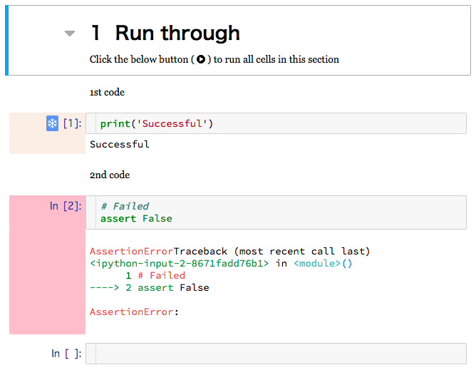

Run through extension for Literate Computing
=========

This extension enables to execute cells contained in a collapsed heading section with one click, and view a summary of hidden outputs.

Successfully executed cells are frozen automatically to prevent to re-run.

# How to use

## Collapse headings

Any markdown heading cell (that is, one which begins with 1-6 # characters), becomes collapsible once rendered.

Please see [readme.md of Collapsible Headings ](https://github.com/ipython-contrib/jupyter_contrib_nbextensions/blob/master/src/jupyter_contrib_nbextensions/nbextensions/collapsible_headings/readme.md) about details.

## Run-through button and summary of outputs

The run-through button and summary of outputs appear in a collapsed heading cell.

The code cells which are collapsed appear as colored bricks.
The colors mean as follows:

- Gray: Not Executed
- Light Green: Successfully Executed
- Light Coral: Failed

A brick with a snowflake means it is *Frozen* cell as below.

The extension provides *Lock*(make the cell read only) and *Freeze*(prevent re-execution) functions like [Freeze extention ](https://github.com/ipython-contrib/jupyter_contrib_nbextensions/tree/master/src/jupyter_contrib_nbextensions/nbextensions/freeze), but also allows to control the *Locked(Read Only)* and *Frozen* states separately.

## Toolbar

When the extension is enabled, the buttons below appear on the toolbar.

For the *Locked(Read Only)* state:

- Make selected cells read-only
- Make selected cells editable

For the *Frozen* state:

- Freeze selected cells
- Unfreeze selected cells
- Unfreeze below in section
- Unfreeze below all
